# 一. 🦁 研究背景及意义
 旅游作为一种经济活动，已经成为世界经济中不可或缺的一部分。旅游业的快速发展，使得旅游产品和服务的供应和需求日益增加，其中旅游网站起着至关重要的作用。近年来，随着移动互联网的普及和技术的进步，旅游网站不断创新和发展，为旅游市场的发展贡献了巨大的力量。

旅游网站的研究背景在于，通过对旅游网站的市场现状、用户需求和技术创新等方面进行研究，以更好地了解旅游网站的发展趋势和用户特征，进而为旅游网站的设计和优化提供依据，提升旅游网站的服务质量和用户体验。

旅游网站的研究意义在于，为旅游网站的设计和优化提供了思路和方法，以满足用户多样化的需求。同时，可以帮助企业更好地把握市场的机遇和挑战，提升旅游产品和服务的质量和效益。此外，随着旅游业的不断发展，旅游网站的研究也为旅游业的升级和转型提供了有价值的参考和借鉴。综上所述，旅游网站的研究具有十分重要和现实的意义。
# 二. 🦁 技术栈系列及主要功能
## Ⅰ. 技术栈
- **Springboot**
- **SpringMVC**
- **MySQL**
- **Mybatis-Plus**
- **SpringSecurity**
- **Thymeleaf**
- **AdminLTE2**
- **lombok、ajax、logback**
## Ⅱ. 主要功能
本系统基于以上技术来实现一个完善的旅游网后台管理系统，具有以下主要功能：
- 管理员管理
- 角色管理
- 权限管理
- 认证和授权
- 产品类型管理
- 旅游产品管理
# 三. 🦁 项目搭建
## Ⅰ. 后端模块
该项目和平常项目差不多，后端模块按平常Springboot项目结构搭建即可，如下：

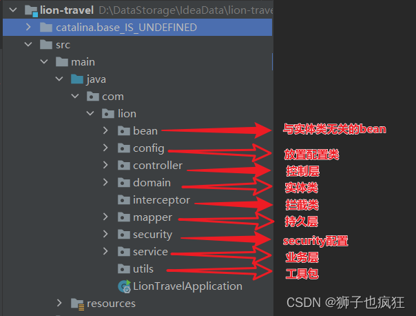

## Ⅱ. 前端模块
在项目中，我们使用AdminLTE框架作为管理员端页面，使用自己编写的网页作为用户端页面。
>tips:
>AdminLTE是一款建立在bootstrap和jquery之上的开源的模板主题工具，它提供了一系列响应的、 可重复使用的组件，并内置了多个模板页面；同时自适应多种屏幕分辨率，兼容PC和移动端。通过AdminLTE，我们可以快速的创建一个响应式的Html5网站。AdminLTE框架在网页架构与设计上，有很大的辅助作用，尤其是前端架构设计师，用好AdminLTE 不但美观，而且可以免去写很大CSS与JS的工作量。

使用AdminLTE非常简单，只需要根据需求将需要的组件复制到我们的页面中即可。

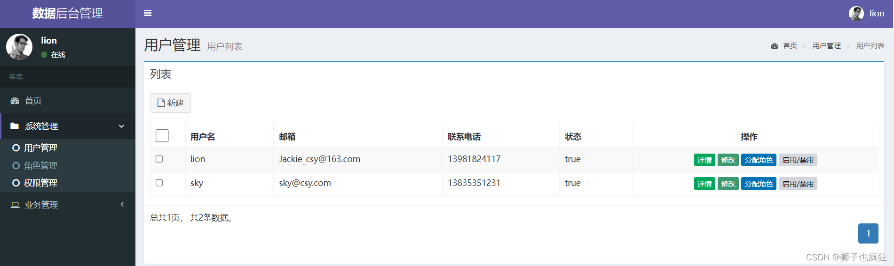

# 四. 🦁 主要实现过程
主要挑几个核心部分来展开描述：
## Ⅰ. 认证和授权
### 1. SpringSecurity配置类
众所周知，SpringSecurity遵循**RBAC原则**，即角色，权限，用户表，在我们添加完这个表的实体类以及一些常规CRUD操作后，就可以开始编写系统的认证和授权了。
如何来编写一个权限表？详情请看狮子前面的文章：[点击](https://blog.csdn.net/m0_58847451/article/details/130062083?spm=1001.2014.3001.5501)
```java
import com.lion.security.handler.MyAccessDeniedHandler;
import com.lion.security.handler.MyLoginFailureHandler;
import com.lion.security.handler.MyLoginSuccessHandler;
import org.springframework.context.annotation.Bean;
import org.springframework.context.annotation.Configuration;
import org.springframework.security.config.annotation.method.configuration.EnableGlobalMethodSecurity;
import org.springframework.security.config.annotation.web.builders.HttpSecurity;
import org.springframework.security.config.annotation.web.configuration.WebSecurityConfigurerAdapter;
import org.springframework.security.crypto.bcrypt.BCryptPasswordEncoder;

@Configuration
@EnableGlobalMethodSecurity(prePostEnabled = true)     // 开启注解-鉴权配置
public class SecurityConfig extends WebSecurityConfigurerAdapter {

    // Spring Security配置
    @Override
    protected void configure(HttpSecurity http) throws Exception {
        http.formLogin()
                .loginPage("/backstage/admin_login")         //自定义表单登录
                .usernameParameter("username")          //用户名
                .passwordParameter("password")          //密码
                .loginProcessingUrl("/backstage/admin/login")   //登录提交路径，提交后执行认证逻辑
                .successHandler(new MyLoginSuccessHandler())    //登录成功跳转路径
                .failureHandler(new MyLoginFailureHandler());    //登录失败跳转路径
//          权限拦截配置
        http.authorizeRequests()
                .antMatchers("/backstage/admin/login").permitAll()      //登录不需要认证
                .antMatchers("/backstage/admin_fail").permitAll()       //登录失败不需要认证
                .antMatchers("/backstage/admin_login").permitAll()      //登录页不需要认证
                .antMatchers("/**/*.css","/**/*.js").permitAll()        //静态资源放行
                .antMatchers("/backstage/**").authenticated();          //剩下的都要认证

//        退出登录配置
        http.logout()
                .logoutUrl("/backstage/admin/logout")       //退出登录的路径
                .logoutSuccessUrl("/backstage/admin_login") //退出登录成功后跳转的页面
                .clearAuthentication(true)                  //退出成功后清除认证信息
                .invalidateHttpSession(true);                //退出成功后清除session
//            异常处理
        http.exceptionHandling()
                .accessDeniedHandler(new MyAccessDeniedHandler());  //权限不足处理器

//        关闭csrf防护
        http.csrf().disable();
//        开启跨域访问
        http.cors();

    }
//    密码加密器
    @Bean
    public BCryptPasswordEncoder bCryptPasswordEncoder(){
        return new BCryptPasswordEncoder();
    }
}

```
security的配置类写法很类似，咱们分块来实现：

**自定义表单登录块**——>**权限拦截配置**——>**退出登录配置**——>**异常处理**——>**关闭csrf防护**——> **开启跨域访问**——>**密码加密器**
根据自己需要来编写相应模块，详细目录如下：

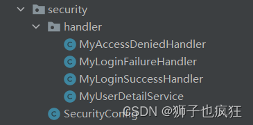

### 2. 自定义逻辑认证

```java
import com.baomidou.mybatisplus.core.conditions.query.QueryWrapper;
import com.lion.domain.Admin;
import com.lion.domain.Permission;
import com.lion.mapper.AdminMapper;
import com.lion.service.AdminService;
import org.springframework.beans.factory.annotation.Autowired;
import org.springframework.security.core.GrantedAuthority;
import org.springframework.security.core.authority.SimpleGrantedAuthority;
import org.springframework.security.core.userdetails.User;
import org.springframework.security.core.userdetails.UserDetails;
import org.springframework.security.core.userdetails.UserDetailsService;
import org.springframework.security.core.userdetails.UsernameNotFoundException;
import org.springframework.stereotype.Service;

import java.util.ArrayList;
import java.util.List;

@Service
public class MyUserDetailService implements UserDetailsService {
    @Autowired
    private AdminService adminService;


    // 自定义认证逻辑
    @Override
    public UserDetails loadUserByUsername(String username) throws UsernameNotFoundException {
        // 1.认证
        Admin admin = adminService.findByAdminName(username);
        if (admin == null) {
            throw new UsernameNotFoundException("用户不存在");
        }
//        admin的状态是不可登录则报错（自定义）
        if (!admin.isStatus()){
            throw new UsernameNotFoundException("用户不可用");
        }


        // 2.授权
        List<Permission> permissions = adminService.findAllPermission(username);
        List<GrantedAuthority> grantedAuthorities = new ArrayList<>();
        for (Permission permission : permissions) {
            grantedAuthorities.add(new SimpleGrantedAuthority(permission.getPermissionDesc()));
        }


        // 3.封装为UserDetails对象
        UserDetails userDetails = User.withUsername(admin.getUsername())
                .password(admin.getPassword())
                .authorities(grantedAuthorities)
                .build();


        // 4.返回封装好的UserDetails对象
        return userDetails;
    }
}
```
## Ⅱ. 富文本编辑器——wangEditor
在项目中，我们使用中国人开发的一个富文本编辑器——wangEditor，官网地
址：[https://www.wangeditor.com/](https://www.wangeditor.com/)
使用步骤如下：
1. 在前端页面中引入 wangEditor.js
2. 在页面中加入 wangEditor 插件
3. 编写实体类返回值
>wangEditor要求上传图片的返回值必须按照它的要求，所以我们创建一个实体类，用于返回上传的结果。

```java
import lombok.Data;

@Data
public class WangEditorResult {
    private int errno;
    private String[] data;
}

```

4. 编写上传控制器，接收富文本编辑器上传的图片

```java
@RequestMapping(value = "/upload")
    @ResponseBody
    public WangEditorResult upload(HttpServletRequest request, MultipartFile file) throws Exception {
        // 创建文件夹，存放上传文件。
        //1.设置上传文件夹的真实路径
        String realPath = ResourceUtils.getURL("classpath:").getPath()+"/static/upload/";;
        //2.判断该文件夹是否存在，如果不存在，新建文件夹
        File dir = new File(realPath);
        if (!dir.exists()){
            dir.mkdirs();
        }
        // 拿到上传文件名
        String filename = file.getOriginalFilename();
        filename = UUID.randomUUID()+filename;
        // 创建空文件
        File newFile = new File(dir, filename);
        // 将上传的文件写到空文件中
        file.transferTo(newFile);


        WangEditorResult wangEditorResult = new WangEditorResult();
        String[] data = {"/upload/"+filename};
        wangEditorResult.setErrno(0);
        wangEditorResult.setData(data);
        return wangEditorResult;
    }
```
5. 在yml中配置上传文件的大小

```xml
# 上传文件
  servlet:
    multipart:
      max-file-size: 10MB # 最大单个文件
      max-request-size: 10MB # 一次请求最大上传
```
这样，一个编辑器就完成了！！！
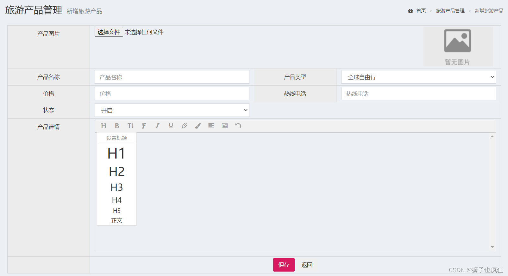


## Ⅲ. 编写AOP实现日志记录功能
### 1. 编写logback.xml文件
在后台代码运行的过程中，我们要对每一次操作进行日志记录，一方面通过日志可以发现代码的缺陷，另一方面可以追踪内部人员的操作记录。
**SpringBoot默认使用Logback组件作为日志管理，首先在 /resources 下添加Logback配置文件 logback.xml**
```xml
在这里插入代码片<?xml version="1.0" encoding="UTF-8" ?>
<configuration>
    <!--定义日志文件的存储地址-->
    <property name="LOG_HOME" value="${catalina.base}/logs/"/>


    <!-- 控制台输出 -->
    <appender name="Stdout" class="ch.qos.logback.core.ConsoleAppender">
        <!-- 日志输出编码 -->
        <layout class="ch.qos.logback.classic.PatternLayout">
            <!--格式化输出：%d表示日期，%thread表示线程名，%-5level：级别从左显示5个字符宽度%msg：日志消息，%n是换行符-->
            <pattern>%d{MM-dd HH:mm:ss.SSS} [%thread] %-5level %logger{50} - %msg%n
            </pattern>
        </layout>
    </appender>


    <!-- 按照每天生成日志文件 -->
    <appender name="RollingFile" class="ch.qos.logback.core.rolling.RollingFileAppender">
        <rollingPolicy class="ch.qos.logback.core.rolling.TimeBasedRollingPolicy">
            <!--日志文件输出的文件名-->
            <FileNamePattern>${LOG_HOME}/server.%d{yy99-MM-dd}.log</FileNamePattern>
            <MaxHistory>30</MaxHistory>
        </rollingPolicy>
        <layout class="ch.qos.logback.classic.PatternLayout">
            <!--格式化输出：%d表示时间，%thread表示线程名，%-5level：级别从左显示5个字符宽度%msg：日志消息，%n是换行符-->
            <pattern>%d{HH:mm:ss.SSS} [%thread] %-5level %logger{50} - %msg%n
            </pattern>
        </layout>
        <!--日志文件最大的大小-->
        <triggeringPolicy class="ch.qos.logback.core.rolling.SizeBasedTriggeringPolicy">
            <MaxFileSize>10MB</MaxFileSize>
        </triggeringPolicy>
    </appender>


    <!-- 日志输出级别 -->
    <root level="info">
        <appender-ref ref="Stdout"/>
        <appender-ref ref="RollingFile"/>
    </root>
</configuration>
```
写法很固定，理解即可！！！

### 2. 编写日志记录实体类

```java
import lombok.Data;
import java.util.Date;

@Data
public class Log {
    private String url; // 访问的路径
    private Date visitTime; // 访问时间
    private String username; // 访问者
    private String ip; // 访问ip
    private int executionTime; // 访问时长
    private String exceptionMessage; // 异常信息
}

```
### 3. 编写日志AOP类

```bash
import com.lion.bean.Log;
import org.aspectj.lang.JoinPoint;
import org.aspectj.lang.annotation.*;
import org.slf4j.Logger;
import org.slf4j.LoggerFactory;
import org.springframework.beans.factory.annotation.Autowired;
import org.springframework.security.core.context.SecurityContextHolder;
import org.springframework.security.core.userdetails.User;
import org.springframework.stereotype.Component;

import javax.servlet.http.HttpServletRequest;
import java.util.Date;

@Component
@Aspect
public class LogAop {
    @Autowired
    private HttpServletRequest request;
    @Autowired
    private final static Logger logger = LoggerFactory.getLogger(LogAop.class);


    /**
     * 切点，以backstage的所有controller方法作为切点
     */
    @Pointcut("execution(* com.lion.controller.backstage.*.*(..))")
    public void pointCut(){}

    /**
     * 前置通知
     * @param joinPoint
     */
    @Before("pointCut()")
    public void doBefore(JoinPoint joinPoint) {
        // 记录访问时间
        Date date = new Date();
        request.setAttribute("visitTime",date);
    }

    /**
     * 后置通知
     */
    @After("pointCut()")
    public void doAfter(){
        Log log = new Log();

        Date visitTime = (Date) request.getAttribute("visitTime"); // 访问时间
        Date now = new Date();
        int executionTime = (int)(now.getTime() - visitTime.getTime()); // 访问时长
        String ip = request.getRemoteAddr(); // 访问ip
        String url = request.getRequestURI();// 访问路径
        // 拿到security中的User对象
        Object user = SecurityContextHolder.getContext().getAuthentication().getPrincipal();
        if (user instanceof User){
            String username = ((User)user).getUsername();
            log.setUsername(username);
        }
        log.setExecutionTime(executionTime);
        log.setUrl(url);
        log.setIp(ip);
        log.setVisitTime(visitTime);


        logger.info(log.toString());
    }

    /**
     * 异常通知
     * @param ex
     */
    @AfterThrowing(pointcut = "pointCut()",throwing = "ex")
    public void afterThrowing(Throwable ex){
        Log log = new Log();


        Date visitTime = (Date) request.getAttribute("visitTime"); // 访问时间
        Date now = new Date();
        int executionTime = (int) (now.getTime() - visitTime.getTime()); // 访问时长
        String ip = request.getRemoteAddr(); // 访问ip
        String url = request.getRequestURI(); // 访问路径
        // 拿到Security中的User对象
        Object user = SecurityContextHolder.getContext().getAuthentication().getPrincipal();
        if (user instanceof User){
            String username = ((User) user).getUsername();
            log.setUsername(username);
        }
        log.setExecutionTime(executionTime);
        log.setUrl(url);
        log.setIp(ip);
        log.setVisitTime(visitTime);


        // 异常信息
        String exMessage = ex.getMessage();
        log.setExceptionMessage(exMessage);

        logger.info(log.toString());
    }
}
```
以Controller为切点，编写前置通知，后置通知和异常通知，记录用户每一次操作的具体内容。
# 五. 🦁 实现效果
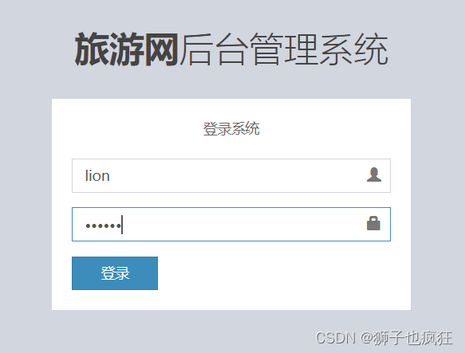

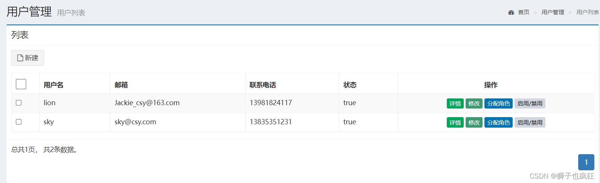
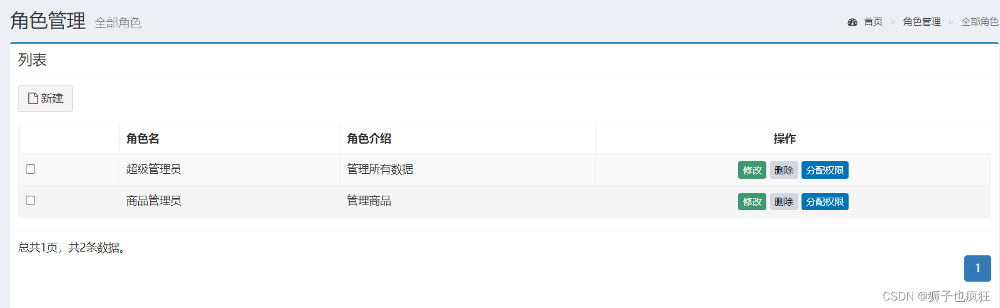
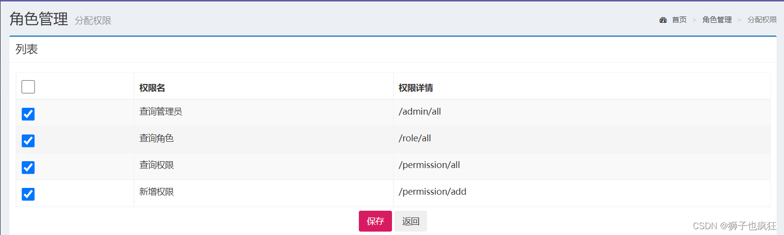
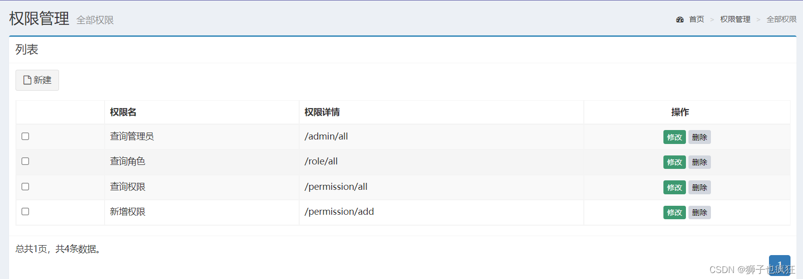
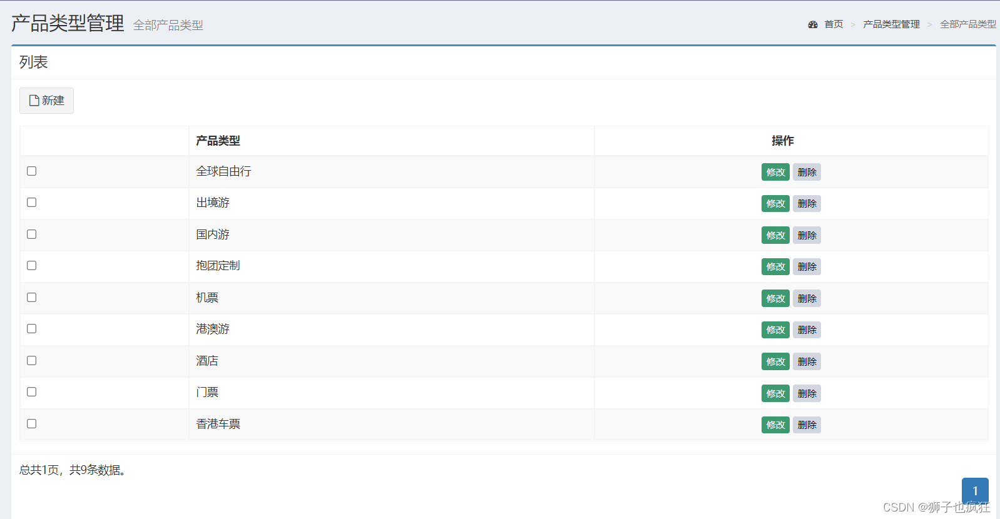
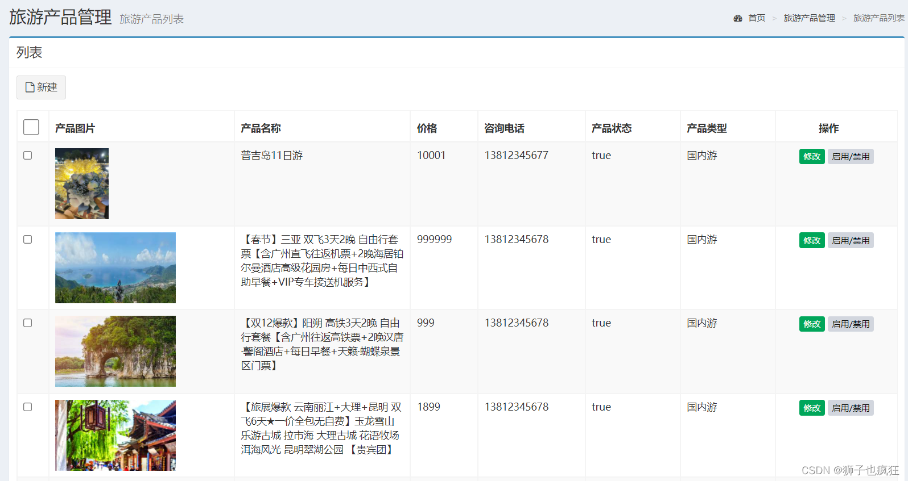

完整源码获取：Csdn 博主by [狮子也疯狂](https://lions.blog.csdn.net/article/details/130452068)
<br/>
VX get：2373489842
